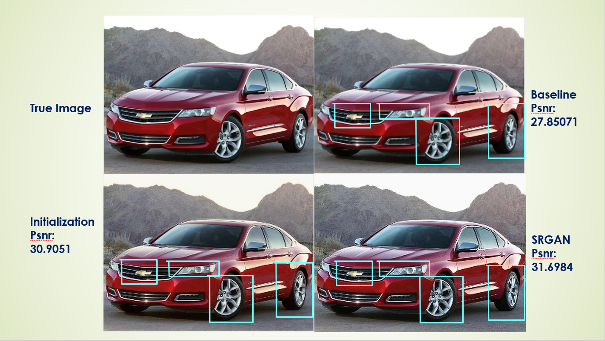
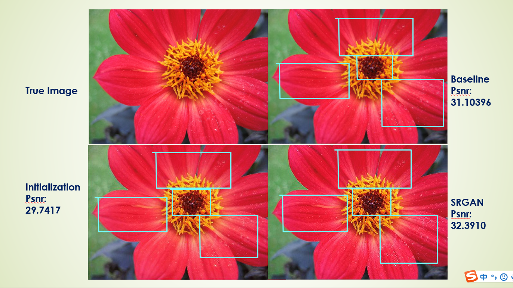

# Project3: Super-resolution: Improving resolution of blurry images


### [Full Project Description](doc/project3_desc.md)


### Team members (Group 12)
+ team leader Wang, Guanren gw2380@columbia.edu
+ team member Zheng, Fei fz2277@columbia.edu
+ team member Hu, Yiyao yh3076@columbia.edu
+ team member Yang, Xi xy2378@columbia.edu


[**Presentation**](https://https://github.com/Grandeurwang/Super_Revolution_of_low_revoltion_images/blob/master/doc/Presentation%20Project3%20Group12.pptx)

### Background
For this project, we have a set of 1500 pairs of images. For each pair, we have a high-resolution image as the ground truth and a down-sampled low-resolution image as the input for the learning task. The goal is to produce a high resolution image as close to the ground truth as possible based on the low-resolution image.

Suppose that our client is interested in creating an mobile AI app that can enhance the resolution of blurry and low-resolution images.

The portability of this AI program (holding storage and memory cost) and the computational efficiency (test running time cost) are of great concern to client. This translates to a balance between the complexity of variables/features/models used and predictive performance.

### Workflow Diagram


#### [Workflow and Code of Baseline Model](https://https://github.com/Grandeurwang/Super_Revolution_of_low_revoltion_images/blob/master/doc/Presentation%20Project3%20Group12.pptx)

### Project summary:  
+ In this project, we implemented two algorithms to enhance the resolution of blurry and low-resolution images. We **1)** implemented *Gradient Boosting Machine (GBM)* as the baseline model, **2)** implemented *SRGAN* an proved model, and **3)** evaluated the performance gain of improved model against the baseline. We utilized `tensorflow` in python as improved model.For baseline model we used `doParallel`,`gbm` and `EBImage` library in R to do super-resolution of the images. We calculated the MSE and PSNR for evaluation. Our model is beat the nerest-neighbor method, bilinear interpolation and bicubic interpolation.

+ The MSE and PSNR for baseline model are *0.00266* and *25.74* respectively, and the MSE and PSNR for improved model are *0.0022* (because R and Python use different scale for RGB, the best way to compare two models is to use PSNR) and *27.8961* respectively, indicating a better preformance than the baseline models.

### [Data Source](data/train_set)

### Comments about training *SRGAN* model
When use [SRGAN.ipynb](https://github.com/Grandeurwang/Super_Revolution_of_low_revoltion_images/blob/master/doc/SRGAN.ipynb) to run the `srgan` model, just set corresponding `train set path` and `test set path`. Set `validation=Fasle` to use the all the train data to train. Set `n_epoch_init=10` to initialize the model. This might cost about 30 mins locally for each epoch. Set `n_epoch=20` (no less than 10) to train the total `srgan` model. This might cost about 50 mins locally for each epoch.

### Examples of super-revolutioned images by our algorithms:



### Contribution Statement
*Guanren Wang* is responsible for all implementation of the baseline model (GBM) including: deploying Google Cloud VM for parallel computing, feature extraction, cross validation, model training and testing, super-revolution (generate predicted images), final evaluation.

*Fei Zheng* is responsble for all parts of srgan model except the validation.

*Xi Yang* is responsble for README file and code editing, final test and reproduction of the model.

*Yiyao Hu* is responsible for the validation part of srgan model and presentation.

Following [suggestions](http://nicercode.github.io/blog/2013-04-05-projects/) by [RICH FITZJOHN](http://nicercode.github.io/about/#Team) (@richfitz). This folder is orgarnized as follows.

```
proj/
├── lib/
├── data/
├── doc/
├── figs/
└── output/
```

Please see each subfolder for a README file.
