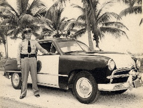
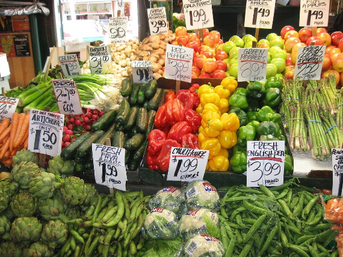

# Training dataset
**LR** is dataset with low-resolution images\
**HR** is dataset with corresponding high-resolution images
**label.csv** has the categories of topics of picture: 
+ label **0** refers to pictures about cars
+ images labeled with **1** are flower pictures
+ label **2** refers to fruit pictures

## Example images
+ **Cars**

+ **Flowers**

+ **Fruits**

